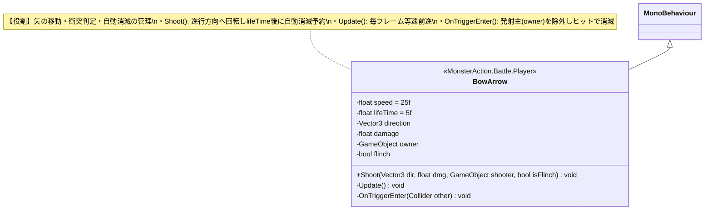

```mermaid
classDiagram
    class MonoBehaviour
    class BowArrow {
        <<MonsterAction.Battle.Player>>
        -float speed = 25f
        -float lifeTime = 5f
        -Vector3 direction
        -float damage
        -GameObject owner
        -bool flinch
        +Shoot(Vector3 dir, float dmg, GameObject shooter, bool isFlinch) void
        -Update() void
        -OnTriggerEnter(Collider other) void
    }

    MonoBehaviour <|-- BowArrow

    note for BowArrow "【役割】矢の移動・衝突判定・自動消滅の管理\n・Shoot(): 進行方向へ回転しlifeTime後に自動消滅予約\n・Update(): 毎フレーム等速前進\n・OnTriggerEnter(): 発射主(owner)を除外しヒットで消滅"
```