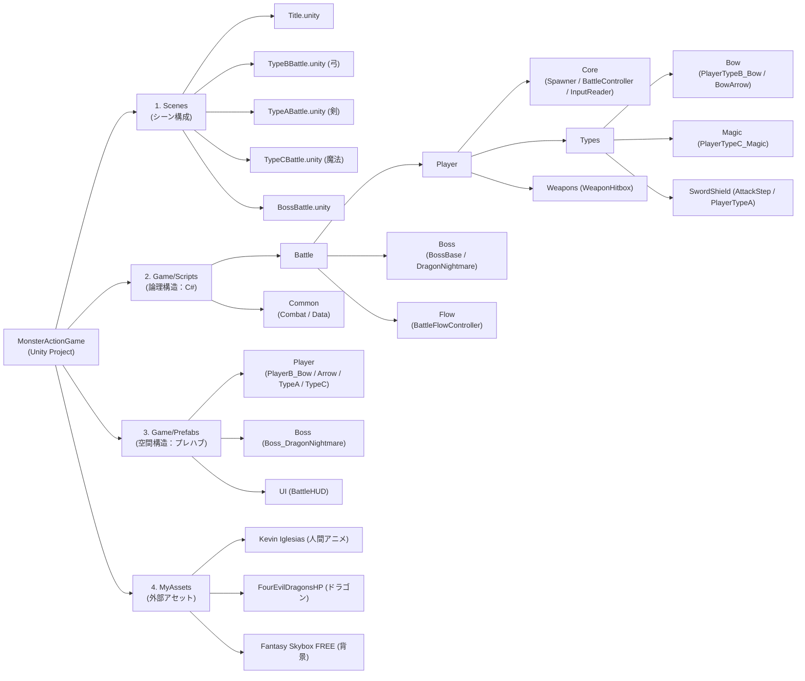

```mermaid
flowchart LR
    Root["MonsterActionGame<br>(Unity Project)"]

    Root --> Scenes["1. Scenes<br>(シーン構成)"]
    Root --> Scripts["2. Game/Scripts<br>(論理構造：C#)"]
    Root --> Prefabs["3. Game/Prefabs<br>(空間構造：プレハブ)"]
    Root --> Assets["4. MyAssets<br>(外部アセット)"]

    %% Scenes
    Scenes --> S_Title["Title.unity"]
    Scenes --> S_Bow["TypeBBattle.unity (弓)"]
    Scenes --> S_Sword["TypeABattle.unity (剣)"]
    Scenes --> S_Magic["TypeCBattle.unity (魔法)"]
    Scenes --> S_Boss["BossBattle.unity"]

    %% Scripts
    Scripts --> Sc_Battle["Battle"]
    Scripts --> Sc_Common["Common<br>(Combat / Data)"]
    Sc_Battle --> Sc_Player["Player"]
    Sc_Battle --> Sc_Boss["Boss<br>(BossBase / DragonNightmare)"]
    Sc_Battle --> Sc_Flow["Flow<br>(BattleFlowController)"]

    Sc_Player --> P_Core["Core<br>(Spawner / BattleController / InputReader)"]
    Sc_Player --> P_Types["Types"]
    Sc_Player --> P_Weapons["Weapons (WeaponHitbox)"]

    P_Types --> T_Bow["Bow<br>(PlayerTypeB_Bow / BowArrow)"]
    P_Types --> T_Magic["Magic (PlayerTypeC_Magic)"]
    P_Types --> T_Sword["SwordShield (AttackStep / PlayerTypeA)"]

    %% Prefabs
    Prefabs --> Pr_Player["Player<br>(PlayerB_Bow / Arrow / TypeA / TypeC)"]
    Prefabs --> Pr_Boss["Boss (Boss_DragonNightmare)"]
    Prefabs --> Pr_UI["UI (BattleHUD)"]

    %% MyAssets
    Assets --> A_Kevin["Kevin Iglesias (人間アニメ)"]
    Assets --> A_Dragon["FourEvilDragonsHP (ドラゴン)"]
    Assets --> A_Sky["Fantasy Skybox FREE (背景)"]
```