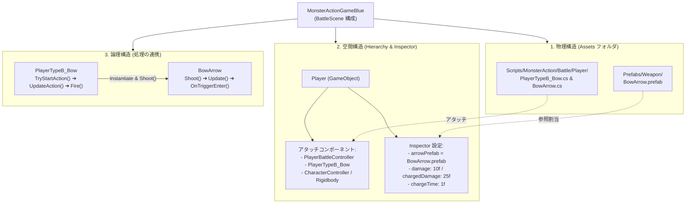

```mermaid
flowchart TD
    Root["MonsterActionGameBlue<br>(BattleScene 構成)"]

    subgraph Physical ["1. 物理構造 (Assets フォルダ)"]
        F_Script["Scripts/MonsterAction/Battle/Player/<br>PlayerTypeB_Bow.cs & BowArrow.cs"]
        F_Prefab["Prefabs/Weapon/<br>BowArrow.prefab"]
    end

    subgraph Spatial ["2. 空間構造 (Hierarchy & Inspector)"]
        H_Player["Player (GameObject)"]
        H_Comp["アタッチコンポーネント:<br>- PlayerBattleController<br>- PlayerTypeB_Bow<br>- CharacterController / Rigidbody"]
        H_Insp["Inspector 設定:<br>- arrowPrefab = BowArrow.prefab<br>- damage: 10f / chargedDamage: 25f<br>- chargeTime: 1f"]
        H_Player --> H_Comp
        H_Player --> H_Insp
    end

    subgraph Logic ["3. 論理構造 (処理の連携)"]
        L_Bow["PlayerTypeB_Bow<br>TryStartAction() ➔ UpdateAction() ➔ Fire()"]
        L_Arrow["BowArrow<br>Shoot() ➔ Update() ➔ OnTriggerEnter()"]
        L_Bow -- "Instantiate & Shoot()" --> L_Arrow
    end

    Root --> Physical
    Root --> Spatial
    Root --> Logic
    F_Script -. "アタッチ" .-> H_Comp
    F_Prefab -. "参照割当" .-> H_Insp
```