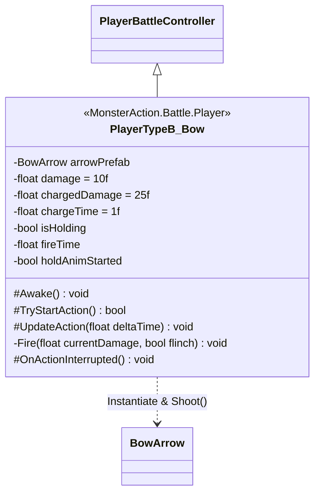

```mermaid
classDiagram
    class PlayerBattleController
    class PlayerTypeB_Bow {
        <<MonsterAction.Battle.Player>>
        -BowArrow arrowPrefab
        -float damage = 10f
        -float chargedDamage = 25f
        -float chargeTime = 1f
        -bool isHolding
        -float fireTime
        -bool holdAnimStarted
        #Awake() void
        #TryStartAction() bool
        #UpdateAction(float deltaTime) void
        -Fire(float currentDamage, bool flinch) void
        #OnActionInterrupted() void
    }
    class BowArrow

    PlayerBattleController <|-- PlayerTypeB_Bow
    PlayerTypeB_Bow ..> BowArrow : Instantiate & Shoot()
```