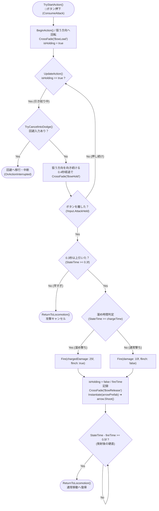

```mermaid
flowchart TD
    Start(["TryStartAction()<br>□ボタン押下 (ConsumeAttack)"]) --> Init["BeginAction() / 狙う方向へ回転<br>CrossFade('BowLoad')<br>isHolding = true"]
    Init --> HoldLoop{"UpdateAction()<br>isHolding == true ?"}

    %% 引いている間の処理
    HoldLoop -- "Yes (引き絞り中)" --> Dodge{"TryCancelIntoDodge()<br>回避入力あり？"}
    Dodge -- "Yes" --> EndAction(["回避へ移行・中断<br>(OnActionInterrupted)"])
    Dodge -- "No" --> Aim["狙う方向を向き続ける<br>0.4秒経過で CrossFade('BowHold')"]
    Aim --> Release{"ボタンを離した？<br>(!Input.AttackHeld)"}
    
    Release -- "No (押し続け)" --> HoldLoop
    Release -- "Yes" --> MinTime{"0.3秒以上引いた？<br>(StateTime >= 0.3f)"}
    
    MinTime -- "No (早すぎ)" --> Cancel(["ReturnToLocomotion()<br>攻撃キャンセル"])
    MinTime -- "Yes" --> ChargeCheck{"溜め時間判定<br>(StateTime >= chargeTime)"}
    
    ChargeCheck -- "Yes (溜め撃ち)" --> FireCharged["Fire(chargedDamage: 25f, flinch: true)"]
    ChargeCheck -- "No (通常撃ち)" --> FireNormal["Fire(damage: 10f, flinch: false)"]

    %% 発射処理
    FireCharged --> FireExec["isHolding = false / fireTime記録<br>CrossFade('BowRelease')<br>Instantiate(arrowPrefab) ➔ arrow.Shoot()"]
    FireNormal --> FireExec

    %% 撃った後の硬直
    FireExec --> AfterFire{"StateTime - fireTime >= 0.5f ?<br>(発射後の硬直)"}
    AfterFire -- "No" --> AfterFire
    AfterFire -- "Yes" --> Return(["ReturnToLocomotion()<br>通常移動へ復帰"])
```